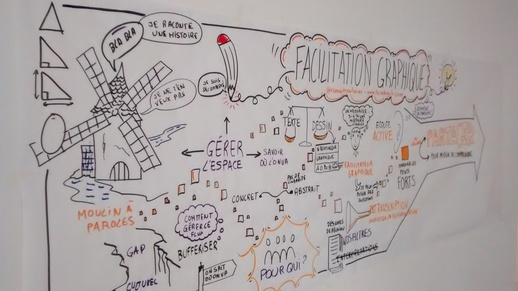

# Formation facilitation graphique

Ma première rencontre avec la facilitation graphique survint lors de
l'événement Agile Grenoble, en  2012. A cette occasion,  j'ai pu admirer la
[fresque réalisée par Nicolas Gros](http://www.fgcp.net/wp-content/uploads/2014/01/fresqueAgileGrenoble2012.jpg). 
Je fus réellement
impressionné par cette oeuvre et très interrogatif sur le rôle que pouvait
avoir un tel support en termes de communication. Puis j'ai quelque peu laissé
ce domaine de côté, me promettant d'y revenir lorsque l'occasion se
présenterait. Et c'est en ce début février qu'Ekito a eu l'excellente idée
d'organiser une formation à la  facilitation graphique avec pour formateur
[Romain Couturier](http://talondagile.fr/blog/).

Ce fut tout d'abord un plaisir de revoir Romain Couturier. Je  conseille  à
toute personne intéressée par l'agilité d'écouter ses conférences, toujours
très riches d’enseignements.

Cette fois-ci, Romain venait sur Toulouse afin de dispenser une formation de
deux jours  sur les bases de la facilitation graphique. Je n'ai pas hésité un
seul instant à m'inscrire, voilà une réelle opportunité de découvrir cette
discipline naissante.

Très vite, Romain crée un cadre bienveillant, mettant en confiance tous les
participants et répétant qu’aucun prérequis n’est nécessaire  en termes de
compétences graphiques. Bref, nul besoin de savoir dessiner pour apprendre ni
même dominer le sujet !!!

En effet le sujet principal n'est pas le dessin mais la facilitation. Comment mieux
communiquer autour de sujets complexes, compliqués, apparemment inextricables.
C'est là l'enjeu de la facilitation graphique. Cela me conforte sur la façon
dont j'appréhende la communication car sur des sujets compliqués, j'ai souvent
ressenti ce besoin de dessiner les divers éléments en jeu, de voir la façon
dont ils s'articulent afin d’obtenir une vision globale et ainsi pouvoir échanger.

Au cours de la première journée, Romain nous livre les clés de la facilitation
qui sont l'écoute, le dessin, et les liens (l'architecture). Et ensuite
premier exercice... là on se lance réellement avec son binôme... Oups !!! Pas si
facile ce premier atelier mais la difficulté n'est pas forcément là où on le
croit... et surtout le bénéfice immédiat est le passage à l'écoute active !
Cela est bien réel et j'ai pu immédiatement le ressentir.

Ces deux jours se dérouleront avec un rythme adéquat à l'assimilation des
différentes notions, et surtout avec une bonne alternance entre théorie et
ateliers. Des ateliers que vous pouvez également mettre en pratique dans votre
quotidien comme celui-ci intitulé  "devenez des voleurs de pictogrammes".

Au terme de ces deux jours de formation, on bénéficie d’une bien meilleure
compréhension de cette discipline et on se dit qu’effectivement il y a
d'indéniables avantages dans le domaine de la facilitation mais pas uniquement
sur cet axe. Convaincu, je me suis promis d’appliquer cette méthode, pour la
prise de notes personnelles lors de futures conférences, dans la rédaction de
synthèses qu’il me faudra réaliser et probablement au cours des formations que
je dispenserai. Si vous souhaitez acquérir une grande compréhension
de la discipline et repartir avec tous les fondamentaux, je ne peux que vous
conseiller de suivre cette formation pour vous lancer.

