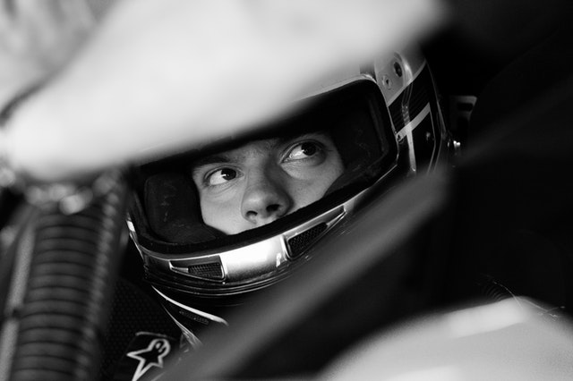

## Rôle du driver

[Photo de Daniel](https://www.pexels.com/fr-fr/photo/image-en-echelle-de-gris-sur-l-homme-portant-un-casque-integral-158967/)

Le mob programming est l'extension du pair programming, les deux rôles
identifiés pour le pair programming sont driver et navigateur.

Le driver est la personne qui a le clavier, son rôle est d'écrire le
code. Le driver est focalisé sur la syntaxe du langage, sur les noms
des variables, des fonctions méthodes bref sur l'ensemble des détails
permettant de produire le code souhaité.

Le navigateur a une plus grande responsabilité, car il se doit de
conserver une vision plus générale du code en cours de
développement. Il sera attentif au design général, il proposera par
exemple l'extraction de méthodes pour gagner en lisibilité ou pour
faire émerger une responsabilité. Lorsqu'une nouvelle responsabilité
est clairement identifiée, il peut alors demander à refactorer la
partie concernée pour, par exemple, créer une nouvelle classe.

Le mob programming reprend ces deux rôles, mais qu'en est-il pour le
rôle du driver au cours d'une session de mob programming ? Il est plus
encore demandé au driver d'être le dactylographe du groupe (du mob)
afin de permettre à chacun de se concentrer sur son domaine de
compétence ou ce sur quoi il accorde de l'importance dans
l'instant. Il est donc demandé au driver de ne point avoir d'idées ,de
ne point pousser d'orientation de design... d'être simplement le
dactylographe du groupe facilitant la transcription des propositions
en code. De rendre cette transcription la plus fluide possible.

## Strong-style pair programming

Le mob programming utilise un pattern particulier du pair programming
dénommé «strong-style pairing».  Le [strong style pairing](http://llewellynfalco.blogspot.com/2014/06/llewellyns-strong-style-pairing.html)
a été formalisé pour la première fois par [Falco Llewellyn](http://llewellynfalco.blogspot.com/).

Dont la définition est la suivante :

> For an idea to go from your head into the computer  it MUST go through someone else's hands
>
>  --- Llewellyn Falco

dont la traduction est :

"Pour qu'une idée passe de votre tête à l'ordinateur, elle DOIT passer par les mains de quelqu'un d'autre."

L'objectif est d'expliciter, toute idée que le navigateur pourrait
avoir permettant à l'ensemble des participants d'en comprendre la
teneur.

En imposant cette contrainte, nous cherchons à minimiser
l'anti-pattern consistant à avoir un développeur tenant le clavier et
montrant aux autres ce qu'il conviendrait de faire. L'ensemble des
autres participants devenant alors de simples spectateurs.

C'est la raison pour laquelle il est impérativement demandé au driver
de ne pas avoir d'idée ! Toutefois si ce dernier souhaite proposer une
idée, il est alors recommandé qu'il cède sa place de driver afin de
l'exprimer à haute voie. L'idée proposée pouvant alors être traduite
par un autre driver, respectant ainsi le motto contre-intuitif:

> Pour qu'une idée passe de votre tête à l'ordinateur, elle DOIT passer par les mains de quelqu'un d'autre.
> --- Llewellyn Falco

Mettre en oeuvre cette règle permet une meilleure inclusion et participation de tous et toutes au cours d'une séance de mob programming. 
