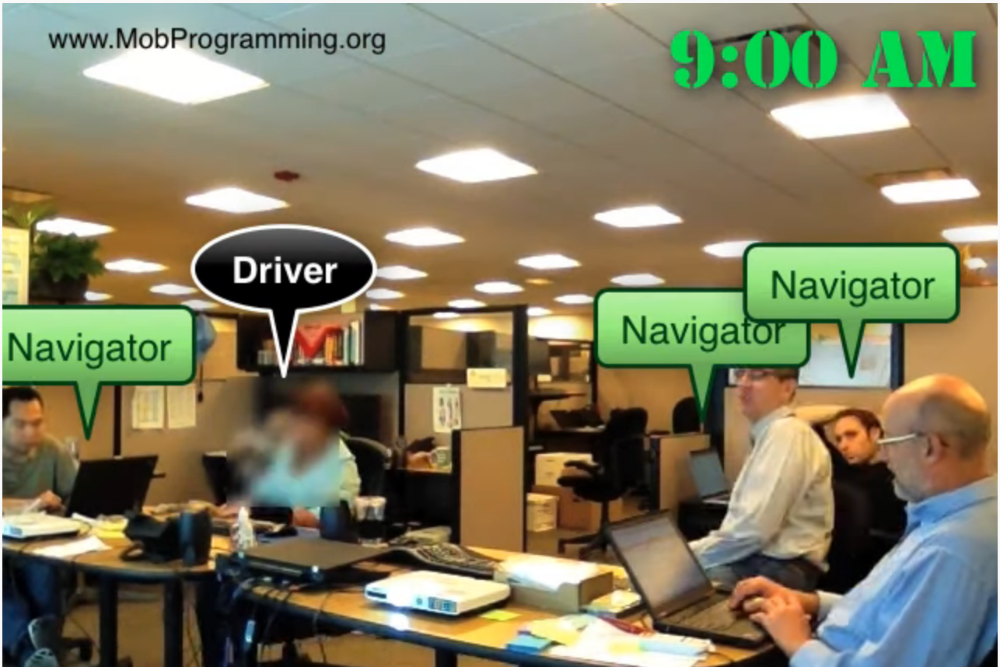

## Rôle du navigateur

Dans le premier article nous avons vu le rôle du driver, nous allons
dans cet article mieux définir le rôle du/des navigateurs.

Le navigateur endosse une plus grande responsabilité, il a pour rôle de mener
le mob vers un objectif commun. Il se doit de donner une direction en ayant
une vision globale du développement en cours, c'est sa première
responsabilité, mais ce n'est pas la seule.

Un navigateur ou navigatrice doit également s'assurer : 

- que tous et toutes ont une bonne compréhension du contexte, du problème que nous cherchons à solutionner
- que la parole circule librement en étant une succession de dialogues
- que chacun puisse utiliser les tableaux blancs afin de réaliser tout schéma, dessin, annotation s'avérant utile à la compréheson ou résolution du problème...
- qu'il y a un partage des idées et que ces dernières sont prises en compte,
- que tous et toutes sont pleinement focalisés sur le problème que nous cherchons à résoudre et ainsi nous nous engageons à poursuivre la co-construction de la solution.

Ainsi décrits, nous pourrions penser qu'il n'y a qu'un unique navigateur (bien
entendu tournant) au sein du mob à un moment donné. C'est plutôt la
configuration que je conseille pour une équipe s'essayant au mob programming.

En phase d'apprentissage identifier clairement qui est navigateur
permet d'être plus respectueux au fait que la communication doit
toujours s'effectuer sous la forme de **dialogues successifs**.
Permettant ainsi à tous d'écouter ce qu'il se dit et évitant de fait
une cacophonie de dialogues simultanés.

Lors de cette période d'apprentissage j'encourage les membres du
mob à engager un dialogue uniquement avec le navigateur. Il est
possible d'utiliser un bâton de parole ou alors de lever la main
lorsque l'on souhaite avoir un dialogue avec le navigateur.

Lorsque la règle du dialogue est intériorisée ainsi que celle de l'engagement
à poursuivre la co-construction d'une solution, il est alors envisageable de
considérer que tout membre de l'équipe est navigateur (hormis le driver). Le
rôle de navigateur circulant librement entre les membres comme nous le suggère
la première vidéo présentée par Woody Zuill en 2012 ([A day of Mob
Programming](https://www.youtube.com/watch?v=p_pvslS4gEI)

