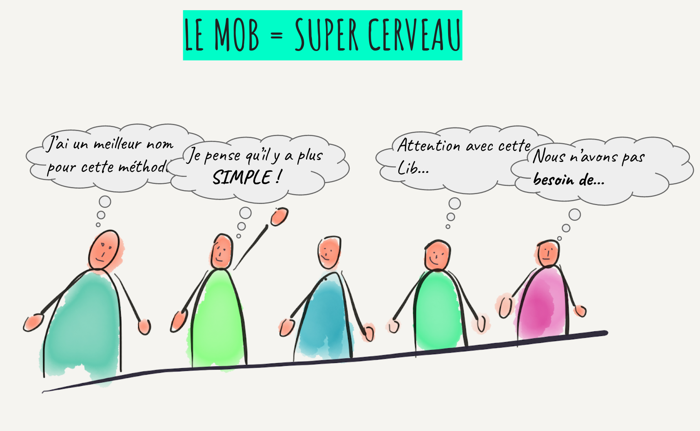
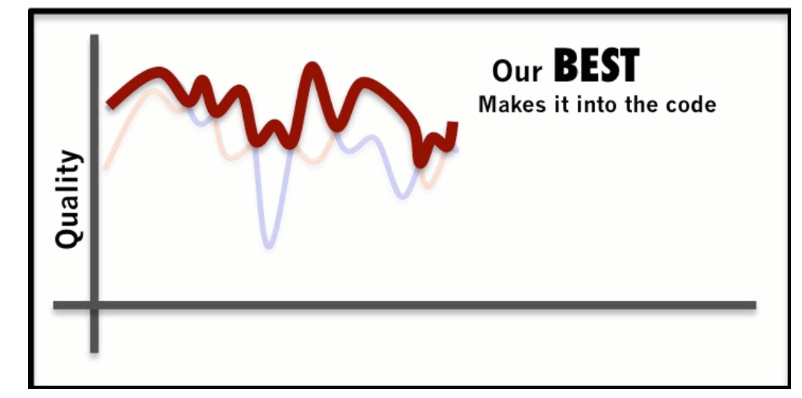
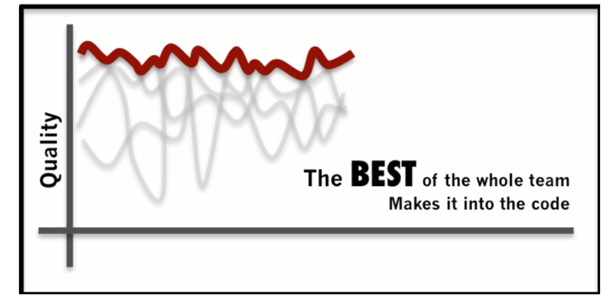
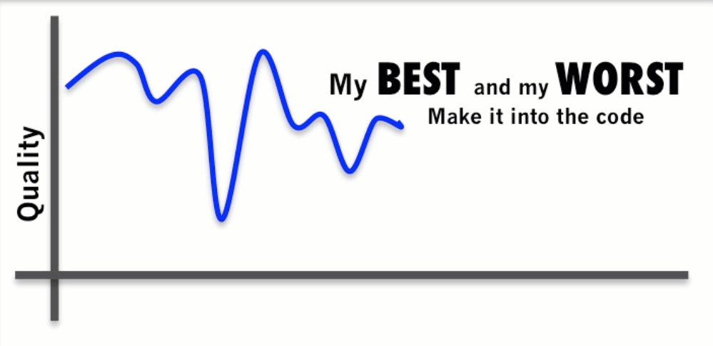

## Qu'est-ce le mob programming ?

Le mob programming est une extension du pair programming ou binômage.
Le pair programming se définit par deux développeurs travaillant sur
un seul ordinateur, c'est donc deux cerveaux co-développant une
fonctionnalité, corrigeant un bug... Nous parlons donc de mob
programming lorsque plus deux développeurs partagent un seul
ordinateur. Woody Zuill (co-créateur de la pratique du mob
programming) en donne la définition suivante :

> Toutes ces brillantes personnes travaillant sur la même chose, au
> même moment, dans le même espace et sur le même ordinateur."
> -- Woody Zuill 

Que cherchons réellement à réaliser au cours d'une séance de mob
programming ? Nous cherchons à créer un super cerveau. Il s'agit en
cela d'une extension du pair programming. Dans le pair programming,
celui qui n'a pas le clavier a le rôle de navigateur. C'est lui qui
donne la direction, il a prend alors le recule nécessaire par rapport
au code, se focalisant plutôt sur la conception globale améliorant
ainsi la qualité de la solution développée.

En mob programming nous cherchons à amplifier ce bénéfice. Les
différents regards braqués sur un même morceau de code permettent
d'apporter une attention toute particulière à la solution développée.
Chacun et chacune pouvant se concentrer sur son domaine de
compétences, nous obtenons le meilleur de l'équipe.

## Amplifier l'écoute

Ce super cerveau ne peut fonctionner correctement que s'il se trouve
doté de bonnes oreilles. Pour cela nous devons développer notre
faculté d'écoute. En cela et pas seulement, le mob programming
s'apprend. Il convient à chacun d'être attentif aux autres
coéquipiers. C'est la raison pour laquelle, je conseille aux
coéquipiers débutant en mob programming de ne pas prendre la parole de
façon impromptue, mais de lever la main lorsque quelqu'un souhaite
intervenir.

[Photo de Andrea Piacquadio](https://www.pexels.com/fr-fr/@olly)

Une bonne session de mob programming est constituée d'une succession
de dialogues tournants, donnant à chacun la possibilité de s'exprimer.

## Obtenir le meilleur de l'équipe

C'est ainsi qu'il est possible d'obtenir le meilleur de l'équipe.

[Llewellyn Falco](http://llewellynfalco.blogspot.com/) l'explicite fort justement avec ces [excellents diagrammes](http://llewellynfalco.blogspot.com/p/infographics.html#GettingTheBestfromtheMob) 

Pour le pair programming, nous obtenons ce type de bénéfice :

et en mob programming, nous obtenons le meilleur de l'équipe :

Avec l'apprentissage nécessaire, ce bénéfice s'obtient assez aisément
et surtout nous évitons la piétre qualité le plus souvent produit en solo.

Ce que l'approche [Extreme programming](http://www.extremeprogramming.org/rules.html) avec parfaitement mise en avant :

> All production code is pair programmed.

Photo de Andrea Piacquadio 
