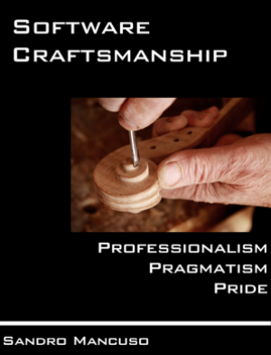

# Sandro Mancuso

Sandro Mancuso nous livre là un fort bel ouvrage ! Il nous décrit simplement et
efficacement la conception qu'il a du métier de développeur.
Vision à laquelle je m'associe pleinement. Si vous cherchez un livre technique
relatif aux : TDD, refactoring... passez votre chemin (mais pas trop vite tout
de même, je vous encourage à lire ne serait-ce que les deux premiers chapitres).
Ce livre s'adresse à tous et pas seulement aux développeurs. Managers, décideurs,
chefs de projets, chefs d'équipe, coach... lisez ce livre !

Sandro commence par nous conter les débuts de sa carrière, notamment en
relatant le premier moment fort de sa vie de développeur quand le responsable de
l'équipe lui explique, au cours d'une revue de code, que la façon dont on
réalise quelque chose est aussi important que le fait de l'achever ("How it is done as
important as having it done"). C'est dix ans plus tard qu'il fonda le mouvement
Software Craftsmanship de Londres (LSCC) ayant cette citation pour maxime.

## La qualité du code

C'est au cours de cette étroite collaboration avec le responsable d'équipe
qu'il s'apperçoit, pour la première fois de sa carrière, qu'il vient de
rencontrer un bien meilleur développeur que lui ayant à coeur de produire des
logiciels de grande qualité et prenant le temps de faire progresser ses
collègues. Pendant les deux années qu'il passa au sein de cette équipe, même si
techniquement il apprit beaucoup, ce qui le marqua le plus fut l'attitude
qu'avaient les membres de l'équipe les uns envers les autres. Il venait de
découvrir une autre approche du développement et c'est le sujet central de cet
ouvrage. Sandro nous montre que le modèle (mainstream ?) considérant un
développeur comme un travailleur (pour lequel j'ai le plus grand respect) d'une
chaine de production, ce modèle est inadapté et inopérant au monde du logiciel.

Dans la première partie il démontre qu'aujourd'hui un développeur doit être
multi-compétent car il doit pouvoir : parler aux clients, automatiser les
tests et le déploiement, travailler avec une équipe distribuée, gérer le
changement et les attentes, comprendre les objectifs métier, garder un oeil sur
les nouvelles technologies tout en s'améliorant... Bref ce discours, que l'on a
trop souvent entendu, consistant à dire "S'il ne s'agit pas de code cela ne me
concerne pas." est un discours appartenant au passé et totalement inacceptable.
L'ouverture d'esprit et la polyvalence sont donc requis.

Plus que jamais, les entreprises ont besoin de vrais professionnels du
développement car à l'heure où les applications sont utilisées par des millions
de personnes, le moindre bug peut s'avèrer fort coûteux. Plus que jamais, nous
avons donc besoin de développeurs professionnels et non pas juste de codeurs
peu onéreux. C'est ce changement de mentalité qu'il nous faut maintenant opérer
dans toute entreprise impliquée dans le développement du logiciel. C'est là le
message envoyé par Sandro.

## Une attention à l'excellence technique

Alors que nos modes de fonctionnement ont changés, car nous comprenons et
intégrons (plus ou moins correctement) différentes approches permettant
d'embrasser le changement tels que : XP, scrum, kanban, le lean startup... nous
demeurons trop souvent incapable de gérer durablement le changement au coeur du
développement d'un logiciel. Car fréquemment les entreprises oublient le 9ème
principe du manifeste agile : "Une attention continue à l'excellence technique
et à une bonne conception renforce l’Agilité". Sandro nous montre qu'atteindre
cet objectif ce n'est pas si difficile. Il s'agit pour l'essentiel de
développer cette culture de la qualité au sein des équipes. Sandro nous présente
bien des pistes de réflexion, mais pas seulement. Il apporte également de
nombreuses réponses au travers des différents chapitres, toujours avec beaucoup
d'humilité et sans position dogmatique. Bref encore une fois, je vous invite à
le lire.
