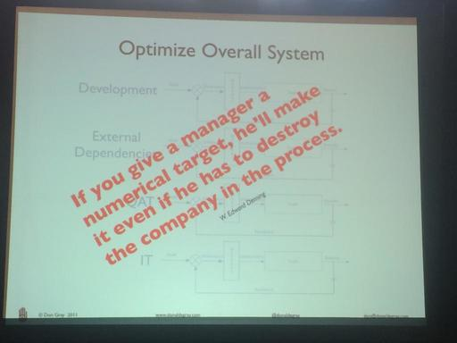
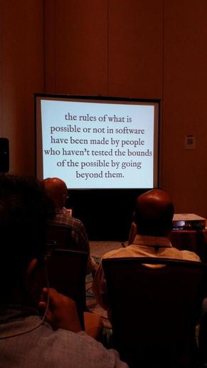

Title: L'actualité en images mais pas que... épisode n°1
Date: 2014-08-01
Modified: 2014-08-01
Tags: image, agile, software craftsmanship
Category: Images & Agilité
Author: Anthony Cassaigne

Quelques images collectées de-ci de-là concernant l'actualité de l'agilité et
surtout porteuse de sens ainsi que quelques courtes citations du moment.

--- 
>Delivery of working valuable software is a metric that can't be easily
gamed. Maintaining sustainable pace, too.  
@jprusakova   

---

@richardnystroms

---
>Measurement is a good servant, but as a master it is a desaster.  
@bbogsnes #agile2014

---
  
@OlaLewitz
