Title: Agilité en images
Date: 2014-07-15
Modified: 2014-07-26
Tags: image, agile, software craftsmanship
Category: Images & Agilité
Author: Anthony Cassaigne

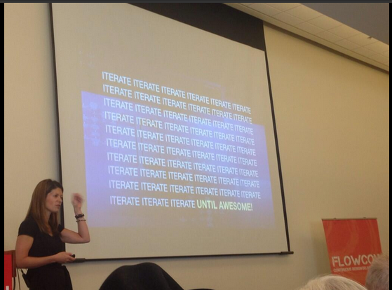  

---
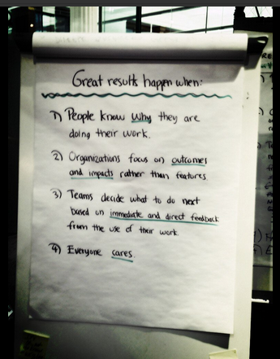  

---
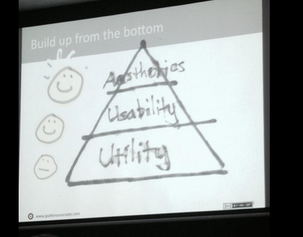  

---
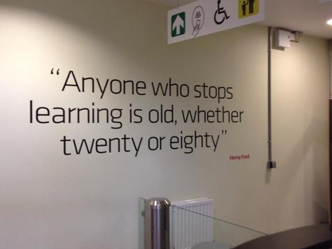  

---
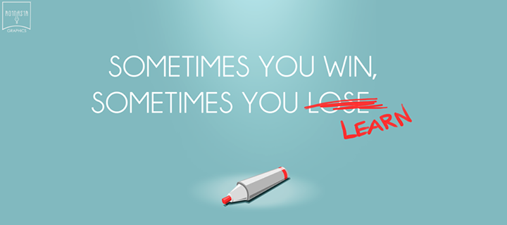 

---
Anti-pattern  
Lisez [The mythical man month](http://www.goodreads.com/book/show/13629.The_Mythical_Man_Month) !!!
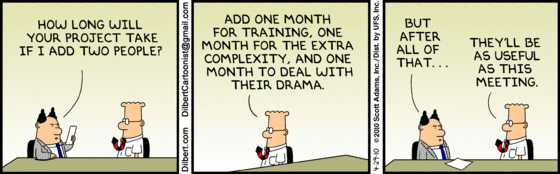

---
D'où l'importance des rétrospectives.  
Veuillez mettre en oeuvre ce principe du manifeste Agile :
>À intervalles réguliers, l'équipe réfléchit aux moyens
de devenir plus efficace, puis règle et modifie son
comportement en conséquence.

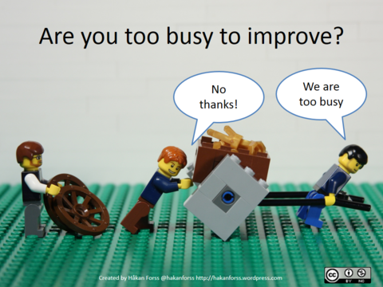

---
Yep, amélioration continue... vive les rétrospectives !
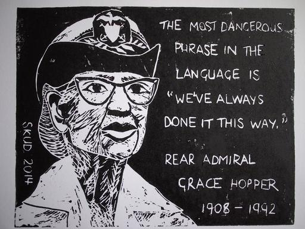

---

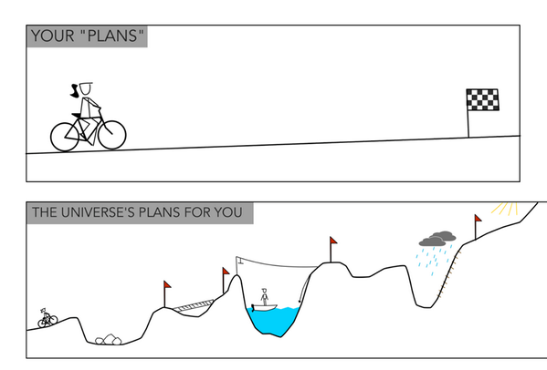

---
Motivation et on ne se lasse pas d'apprendre.
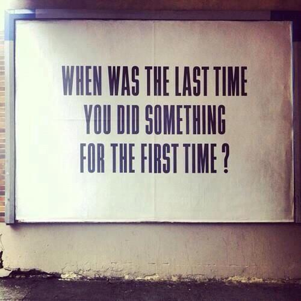

---

Ouaip pas faux... ne rien lacher.
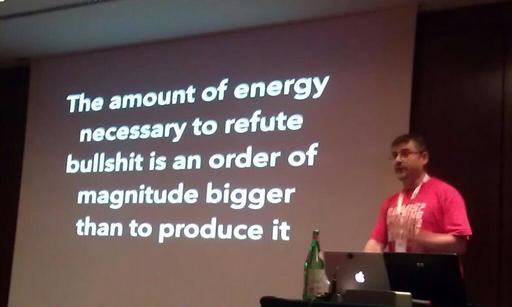

---

Anti-pattern du principe : 
>Les processus Agiles encouragent un rythme de développement soutenable. Ensemble, les commanditaires, les développeurs et les utilisateurs devraient être capables de maintenir indéfiniment un rythme constant.  

---

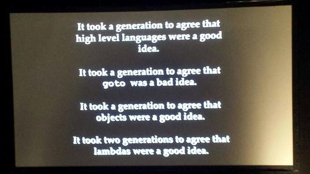

---

Nous avons besoin de plusieurs chemins pour atteindre l'objectif !
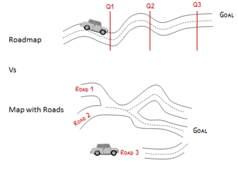

---
haaaaa le manque de communication... bel exemple d'anti-pattern :

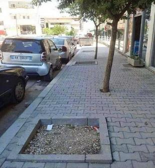

Bref, mettez en oeuvre ces principes du manifeste Agile:
>Les utilisateurs ou leurs représentants et les 
développeurs doivent travailler ensemble quotidiennement
tout au long du projet.

et

>La méthode la plus simple et la plus efficace pour 
transmettre de l’information à l'équipe de développement
et à l’intérieur de celle-ci est le dialogue en face à face.

---
Attention même lors d'une conversation en face à face, ne pas oublier :
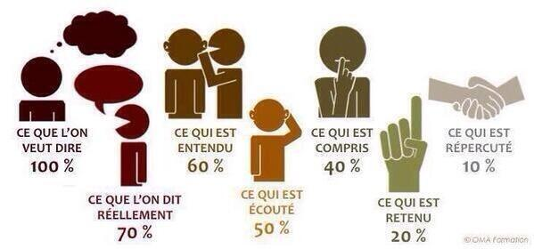

Tableau blanc, dessin, schéma, vidéo, facilitation graphique... toute technique pour augmenter la bande passante et pour construire une compréhension commune est à favoriser.
Poursuivre par [Tom Wujec](http://www.ted.com/talks/tom_wujec_on_3_ways_the_brain_creates_meaning?language=en)

---

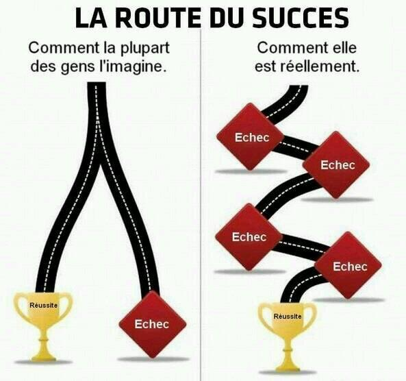

---
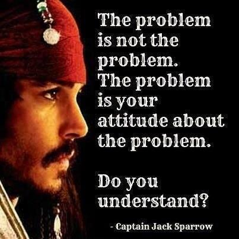

---

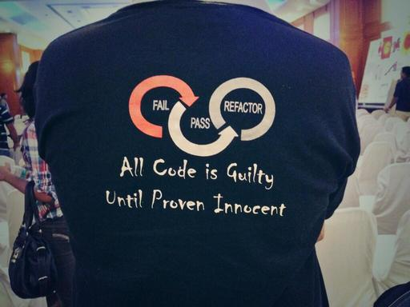

---

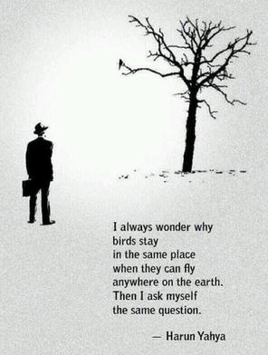

---

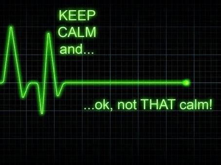

Comme le dit [Mario Andretti](http://en.wikipedia.org/wiki/Mario_Andretti)
>If everything’s under control,  
you’re going too slow!

---

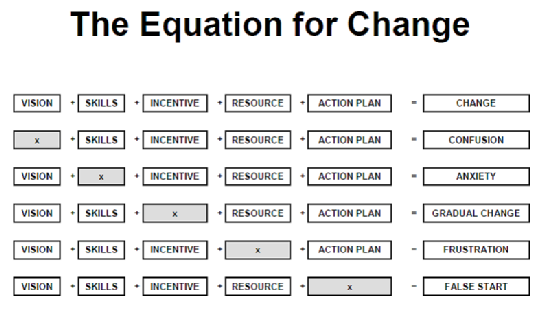

---

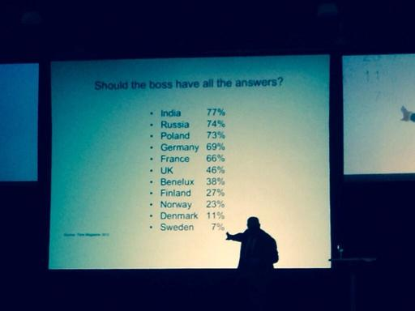

---
Que dire de la dette technique :
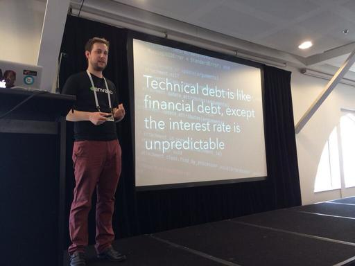

---
About refactoring...
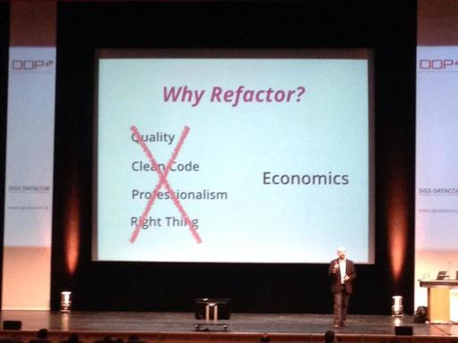

--- 

Ne pas oublier ! 

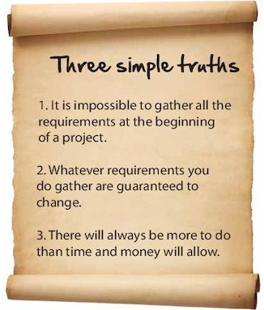

Extrait du livre [The Agile Samurai](http://pragprog.com/book/jtrap/the-agile-samurai)

---
>About Scrum...
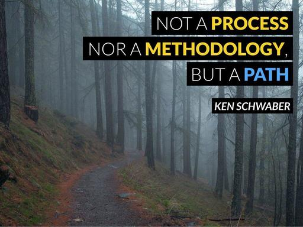

---
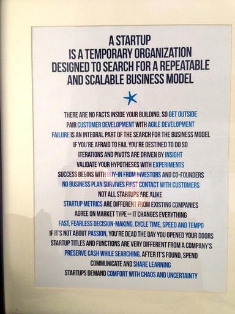

---
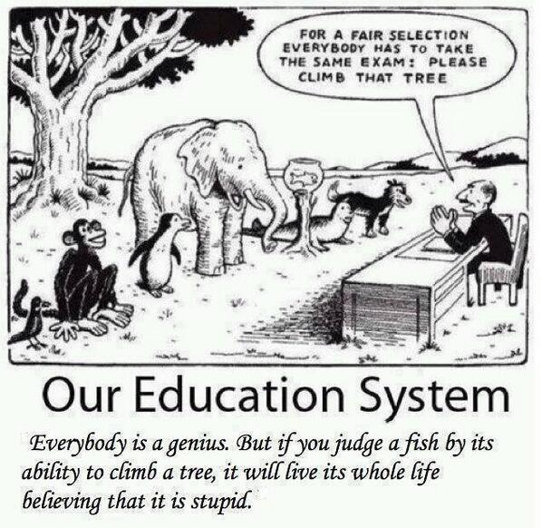
